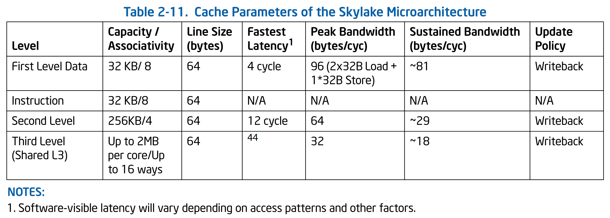
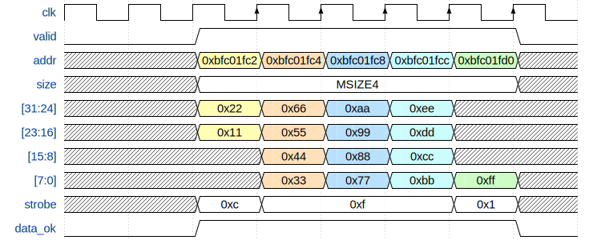

# 实验 2a：总线仲裁与延时

## 仲裁

多个独立运行的实体同时访问共享资源时，往往需要通过仲裁决定访问的先后顺序。

在实验 1 中，CPU 有两套访存接口：一个用于取指，另一个用于读写数据。`test1_naive` 将指令内存和数据内存分开了，从而能够同时支持两边的访问。现实生活中的计算机架构一般遵循 von Neumann 架构，即指令和数据放在同一个内存中。此时需要内存有两个读写端口。

但是多端口的存储单元往往非常消耗资源（例如，6 端口寄存器文件）。现代的 CPU 的核心数量越来越多，提供多端口的存储单元非常不现实。此外，如果有两个或者更多的端口同时写入同一个位置时，我们需要规定谁的写入是有效的，此时发生了写入冲突。

解决这一问题的一种方法是仲裁，即当有多个实体同时访问同一个对象时，允许其中一个进行访问，要求其它的实体等待。这个过程类似于加锁互斥。

`test1`~`test4` 的内存都只有一个端口，因此需要进行仲裁。

## 延时

仲裁会导致等待，因此我们不能再期望数据会在固定的时间内返回。此外，现代 CPU 的主频和内存频率往往不同，并且 CPU 为了降低功耗通常会动态调频，因此增加了访存需要的周期数的不确定性。下表是 Intel 的 Skylake 架构中 cache 的各项参数，来自 “Intel 64 and IA-32 Architectures Optimization Reference Manual”：



可以看到各级缓存的访问所需要的周期数都是不一样的，并且都不是固定的。

## DBus

DBus 是一个单向握手协议，其定义在 `common.svh` 中：

```verilog
typedef struct packed {
    logic    valid;   // in request?
    addr_t   addr;    // target address
    msize_t  size;    // number of bytes
    strobe_t strobe;  // which bytes are enabled? set to zeros for read request
    word_t   data;    // the data to write
} dbus_req_t;

typedef struct packed {
    logic  addr_ok;  // is the address accepted by cache?
    logic  data_ok;  // is the field "data" valid?
    word_t data;     // the data read from cache
} dbus_resp_t;
```

### 总线握手

DBus 的逻辑是：由 CPU 主动发出请求（拉起 `valid` 信号），等待内存给出反馈（`addr_ok` 和 `data_ok`）。DBus 的反馈分为两个阶段，一是内存已经得知并且缓存了 CPU 的请求，此时内存会将 `addr_ok` 拉起；二是内存已经完成了 CPU 的请求，此时将 `data_ok` 拉起。这两个过程就是所谓的 “握手”。握手是一个时序逻辑。每当时钟周期上升沿触发时，如果 `addr_ok` 为 `1`，表明握手成功。`data_ok` 同理。例如，CPU 想写入内存，内存也支持单周期写入，此时内存会把 `addr_ok` 和 `data_ok` 同时设为 `1`。等到时钟上升沿到达时，内存就会触发写入，同时 CPU 也知道内存已经完成这个写入了。


如果内存需要多个周期才能完成一次访存，CPU 需要一直拉起 `valid` 信号，直到内存的 `addr_ok` 响应。


访存有一个常见的优化是写缓冲区（store buffer）。写缓冲会保存收到的请求，发出 `addr_ok`，然后再进行真正的写内存操作。CPU 一般不用关心写操作是否真的完成了，因此流水线在收到 `addr_ok` 的时候就可以继续推进。这样可以明显减少写内存带来的流水线阻塞。


访存也可以切分流水线。CPU 的 fetch 阶段和 memory 阶段可以分为多个周期完成，此时需要 cache 也按照流水线的方式工作。这样即便单次访存的延时很高，cache 提供的吞吐率却不低。


注意：CPU 收到 `addr_ok` 后，如果没有其它请求，必须把 `valid` 撤下。

### `size` 信号

`size` 是一个枚举。DBus 支持 `MSIZE1`（单字节）、`MSIZE2`（双字节）和 `MSIZE4`（四字节）三种模式。

### Byte Lanes

DBus 是 32 位的总线，每周期至多传输 4 个字节。`data` 的四个字节可以视作四个独立的通道 `lane[3:0]`，`lane[0]` 对应地址最后两位为 `2'b00` 的那个字节，`lane[1]` 对应最后两位为 `2'b01` 的字节，依次类推。因此，无论我们给出的地址是否与 4 字节对齐，`data` 中的数据依然会按照 4 字节对齐的方式摆放。DBus 提供一个 4 位的写使能 `strobe[3:0]`，`strobe[0]` 表示 `lane[0]` 是否启用，`strobe[3..1]` 类似。通过这种方式，DBus 允许写入比 4 字节窄的数据。

例如，我们向地址 `0xbfc001f2` 写入单个字节的数据 `0xcd` 时，由于地址的最低两位为 `0x2`（`2'b10`），所以我们应该：

* 地址 `addr` 依然是 `32'hbfc001f2`。
* 将 `data` 设置为 `32'h00cd0000`。
* 将 `strobe` 设置为 `4'b0100`。

这么做可能比较反直觉。DBus 的 byte lanes 来源于 AXI 总线协议，其意图在于兼容只能 4 字节对齐寻址的设备（一般的内存都是这么做的），同时不要求 `addr` 必须与 4 字节对齐是因为可能会和只能字节寻址的设备交互（例如字符打印）。

换句话说，当你向 `0x1f2` 发送读取请求时，DBus 会把 `0x1f0`、`0x1f1`、`0x1f2` 和 `0x1f3` 这四个地址对应的字节全部返回给你，分别放在 `data[7:0]`、`data[15:8]`、`data[23:16]` 和 `data[31:24]` 中。同样的，当你向 `0x1f2` 这个地址写入时，实际上是同时向 `0x1f0`、`0x1f1`、`0x1f2` 和 `0x1f3` 这四个地址对应的字节写入，不过此时我们可以使用 `strobe` 信号单独决定每个字节是否真的需要写入。

下面展示了从地址 `0xbfc01fc2` 开始连续写入 15 个字节 `0x11`~`0xff` 的过程：



### IBus

IBus 是 DBus 的子集，仅保留了读取 4 字节（`word_t`）的接口。

## 实验内容

下面将分步骤介绍本实验要完成的内容。

### 支持总线延时

在 `mycpu_top.sv` 的开头，有一个宏 `FIXED_LATENCY` 确定该模块使用类 SRAM 接口还是 AXI 接口：

```verilog
/**
 * TODO (Lab2) comment out the following line :)
 */
`define FIXED_LATENCY

module mycpu_top (
`ifdef FIXED_LATENCY
    // ...
```

本次实验你需要将这一行 `define` 注释掉。之后

* `mycpu_top` 会使用 AXI 接口。
* 仿真的顶层模块从 `SRAMTop` 变成 `VTop`。
    * 如果你上一次实验的地址翻译放在 `SRAMTop`，你可能需要将它们迁移到 `VTop`。

这里只修改了 `mycpu_top` 的接口，`MyCore` 依然使用 DBus/IBus。你不需要关心 AXI 接口是如何操作的。如果你感兴趣，可以自行阅读 `util` 文件夹下的 `CBusToAXI.sv`。

你需要修改流水线寄存器的阻塞逻辑。一条 `lw` 指令在 memory 阶段发出访存请求，在数据返回前，显然需要阻塞流水线。

一个简单的改动如下：

```verilog
assign stallF = ~i_data_ok | ~d_data_ok;
assign stallD = ~i_data_ok | ~d_data_ok;
assign stallE = ~d_data_ok;
assign stallM = ~d_data_ok;
assign flushE = ~i_data_ok;
assign flushW = ~d_data_ok;
```

注意：这个处理的性能未必好，内存的写请求不一定需要进行 `data_ok` 的握手。

完成后，你应该能够通过 `vivado/test1` 的测试。

### *实现仲裁器

我们已经提供了一个简单的仲裁器实现，在 `source/util/CBusArbiter.sv` 中。`VTop` 默认使用 `CBusArbiter`：

```verilog
    /**
     * TODO (Lab2) replace mux with your own arbiter :)
     */
    CBusArbiter mux(
        .ireqs({icreq, dcreq}),
        .iresps({icresp, dcresp}),
        .*
    );
```

`CBusArbiter` 有一个缺点，它需要花费一个时钟周期来确定谁有总线的访问权，无论是有多个请求还是只有一个请求。换句话说，`CBusArbiter` 会把所有的访存增加至少一个周期的延时。实际上这一个时钟周期可以被优化掉，只是这么做是要付出代价的。因为这种优化需要添加新的组合逻辑，有可能会增加关键路径的延时，导致 CPU 频率降低。

如果你想优化 `CBusArbiter`，请在 `source/mycpu/MyArbiter.sv` 中实现新的仲裁器，然后将 `VTop` 的 `CBusArbiter mux` 换成 `MyArbiter mux`。

另外请注意：**`CBusArbiter` 默认的仲裁策略是 DBus 比 IBus 优先**。如果你想调换优先级，请将上面 `CBusArbiter mux` 接口中的 `icreq` 和 `dcreq` 对换，以及将 `icresp` 和 `dcresp` 对换。

### 实现新的指令

[“指令列表”](../misc/instruction.md) 中有一张表，记录了 `test1` 到 `test4` 和所有性能测试会用到的指令。请据此确定 `test2` 需要添加的指令并实现。

`test2` 中需要额外实现的指令，主要有以下三类：

* 更多种类的分支跳转。
* 引入了以半字（16 位）和字节（8 位）为粒度的内存读写。
    * 注意调整总线请求的 `size` 部分，以及处理读写的数据。
* 移位的偏移量为寄存器数据。

### 接入 Verilator

下一轮实验会使用 Verilator 做模块级测试。本次实验先用 `test1` 和 `test2`，方便大家熟悉 Verilator 仿真的流程。

我们提供的测试框架里面，Vivado 仿真的顶层是 `mycpu_top`，而 Verilator 仿真的顶层用的通常是字母 `V` 开头的模块[^vtop]（如 `VTop`、`VCacheTop`）。每一个顶层模块对应一个目标名称，也就是 `make vsim` 命令的 `TARGET` 参数。如果想以 `source/mycpu/VTop.sv` 这个文件作为顶层模块，其对应的 `TARGET` 就是 `mycpu/VTop`。

测试框架的代码放在 `verilate/source` 和 `verilate/include` 两个目录下。不同的顶层模块可能需要不同的测试代码，这些代码会分别放在 `verilate/source` 中对应子目录里面。如果 `TARGET` 是 `mycpu/VTop`，那么其专用的测试代码都放在 `verilate/source/mycpu/VTop` 下。我们提供了大部分 `mycpu/VTop` 的测试代码，目前这个目录下有：

* `defs.h`：一些类型定义。
* `mycpu.h`：verilated 模型类的声明。
* `mycpu.cpp`：verilated 模型类的实现。
* `vmain.cpp`：仿真程序 `vmain` 的程序入口的代码。

所谓 verilated 模型是指把 SystemVerilog 描述的模块翻译成 C++ 代码后的一个 `class`。翻译后的 verilated 模型再和测试框架一起编译成可执行文件 `vmain` 后，运行 `vmain` 就会开始正式的仿真。

运行龙芯杯的 `test1` 和 `test2` 需要支持 trace 比对。你需要将 `debug_*` 信号暴露给 verilated 模型。以 writeback 阶段的 PC 为例，假设某个 CPU 结构如下面的代码所示：

```verilog
module Writeback;
    logic [31:0] pc;
endmodule

module MyCore;
    Writeback wb;
endmodule

module VTop;
    MyCore core;
endmodule
```

当 `VTop` 是顶层模块时，从 `VTop` 访问 PC 的跨模块引用应该写成 `core.wb.pc`。为了能在 Verilator 中访问到这个信号，首先你需要将 `pc` 声明为公开的：

```verilog
module Writeback;
    logic [31:0] pc /* verilator public_flat_rd */;
endmodule
```

`/* verilator public_flat_rd */` 是一条 metacomment。其中 `public` 表示信号对外可访问，`flat` 表示信号名会被去层次化（flatten），`rd` 表示只读（read-only）。去层次化意思是 `core.wb.pc` 这个信号在翻译后的 C++ 代码中会以一个普通变量的方式呈现给 verilated 模型。C/C++ 的变量名里面不能有 “`.`”，因此 Verilator 会把 `core.wb.pc` 转换成 `core__DOT__wb__DOT__pc`。之后你需要修改 `verilate/source/mycpu/VTop` 文件夹中的 `mycpu.cpp`：

```c++
auto MyCPU::get_writeback_pc() const -> addr_t {
    /**
     * TODO (Lab2) retrieve PC from verilated model :)
     */
    return VTop->core__DOT__wb__DOT__pc;  // 访问 PC
}
```

这里 `VTop` 是指向顶层模块的作用域（scope）的指针，由 Verilator 自动生成。用 `VTop` 可以访问到先前模块内部公开的信号。当 C++ 代码调用上面这个函数时，就会返回当前 `core.wb.pc` 的值[^pc-type]。你还需要实现另外 3 个类似的函数。

之后在仓库根目录下运行：

```shell
make vsim TARGET=mycpu/VTop TEST=test1 -j
```

将会运行 `test1`。把 `TEST=test1` 换成 `TEST=test2` 就会运行 `test2`。`test1` 会输出以下内容：

```plaintext
./build/gcc/mycpu/VTop/vmain -m misc/nscscc/test1.coe -r misc/nscscc/test1.txt
(info) #1 completed.
(info) #2 completed.
(info) #3 completed.
(info) #4 completed.
(info) #5 completed.
(info) #6 completed.
(info) #7 completed.
(info) #8 completed.
(info) #9 completed.
(info) #10 completed.
(info) #11 completed.
(info) #12 completed.
(info) #13 completed.
(info) #14 completed.
(info) #15 completed.
(info) #16 completed.
(info) #17 completed.
(info) #18 completed.
(info) #19 completed.
(info) #20 completed.
(info) #21 completed.
(info) #22 completed.
(info) #23 completed.
(info) #24 completed.
(info) #25 completed.
(info) #26 completed.
(info) #27 completed.
(info) testbench finished in 337516 cycles (601.973 KHz).
```

### 随机延时

`vmain` 默认情况下并没有随机延时。可以使用 `--p-disable`/`-p` 参数开启随机延时。这个参数是一个概率值，表示内存每个周期无响应的概率。例如：

```shell
make vsim -j TARGET=mycpu/VTop TEST=test1 VSIM_ARGS='-p 0.99'
```

表示内存有 99% 的时间没有响应。如果设置为 `-p 0`，相当于关闭随机延时。

### 记录波形图

如果你不幸没有通过 `vmain` 的测试，看到了类似于下面的报错：

```plaintext
TextDiff: on line 18:
	expect: "1 9fc03be0 10 00000001"
	   got: "1 9fc05100 10 00000001"
make: *** [verilate/Makefile.vsim.mk:123: vsim] Aborted (core dumped)
```

这是 trace 比对出错。你可能需要使用波形图来调试。为了加速仿真，`make vsim` 默认不会记录波形图。使用 `--fst-trace`/`-f` 参数开启波形图记录并且指定波形图文件保存的位置。例如：

```shell
make vsim TARGET=mycpu/VTop TEST=test1 -j VSIM_ARGS="-f build/trace.fst"
```

将会把波形图保存到 `build` 目录下的 `trace.fst`。仿真成功运行或者中途失败退出时，会保存 FST 波形图，并且能在终端输出看到一行信息：

```plaintext
FST trace: stop @558950
```

FST 格式的波形图文件需要用 GTKWave 打开：

```shell
gtkwave build/trace.fst
```

你需要自行摸索 GTKWave 的使用方式。我们提供了一份简短的使用说明：[“使用 GTKWave”](../misc/gtkwave.md)。

如果遇到你无法确定原因的错误，例如 assertion failed、segmentation fault 之类，有可能是测试框架的问题。请及时向助教反馈。如果遇到这些错误时，终端/命令行最后输出了 “`(core dumped)`”（上面 trace 比对出错的输出就有），说明这个错误可以使用 `coredumpctl gdb` 启动 GDB 查看。请进入 GDB 输入 `backtrace` 后回车，将调用栈打印出来，然后连同调用栈和错误信息一起反馈给助教。

### 总结

总结一下实验 2a 要做的事情：

* 修改取指和访存阶段的逻辑，支持多周期访存。
    * 在 Vivado 仿真中通过 `test1`。
* *在 `MyArbiter.sv` 中实现仲裁器。
* 根据 [“指令列表”](../misc/instruction.md) 添加新的指令。
    * 在 Vivado 仿真中通过 `test2`。
* 修改 `verilate/source/mycpu/VTop` 下的 C++ 代码。
    * 在 Verilator 仿真中通过 `test1` 和 `test2`。
* 通过 `test1` 和 `test2` 上板测试。

以上是我们推荐的完成顺序。

## 实验提交

**本实验和实验 2b 一起提交。**

```plaintext
18307130024/
├── report/   （报告所在目录）
├── source/   （源文件所在目录）
└── verilate/ （仿真代码所在目录）
```

用 `zip -r 18307130024.zip 18307130024/` 打包。用 `unzip 18307130024.zip` 检查，应在当前目录下有学号目录。

### 通过标准

* 通过以下四条命令的测试：
    * `make vsim -j TARGET=mycpu/VTop TEST=test1`
    * `make vsim -j TARGET=mycpu/VTop TEST=test1 VSIM_ARGS="-p 0.99"`
    * `make vsim -j TARGET=mycpu/VTop TEST=test2`
    * `make vsim -j TARGET=mycpu/VTop TEST=test2 VSIM_ARGS="-p 0.99"`
* 上板通过 `test1` 和 `test2`。

### 实验报告要求

* 格式：PDF
* 内容：简要记录你所做的修改。写好姓名学号。附上测试通过时的照片或截图。

### 截止时间

**2021 年 4 月 11 日 23:59:59**

## *思考题

* 张三在 `source/util/CBusMultiplexer.sv` 中实现了自己的仲裁器，然而过不了仿真。请指出 `CBusMultiplexer` 存在的问题。
* 龙芯杯的测试框架中有一个叫做 CONFREG 的模块[^confreg]，用来控制 FPGA 上的各种硬件资源，例如 LED 数码管、按钮。CONFREG 是一个 memory-mapped 设备。其中地址 `0xbfaffff0` 是一个简化的 UART 打印接口，往这个地址写入 ASCII 码就可在仿真中输出文字。特别的，如果写入的值是 `0xff`，就会立即停止仿真。

  李四写了一段汇编程序 `hello.s`，放在 `misc/hello` 目录下，它会打印 “Hello, world!”。但是李四买不起 CPU。请尝试将这段汇编代码编译成 `.coe` 文件，然后使用

  ```shell
  make vsim -j TARGET=mycpu/VTop VSIM_ARGS="-m [.coe 文件路径]"
  ```

  在你的 CPU 上运行这个程序。如果没有出错，`vmain` 最后会输出：

  ```plaintext
  ./build/gcc/mycpu/VTop/vmain -m misc/hello/hello.coe
  Hello, world!
  (info) testbench finished in 652 cycles (515.101 KHz).
  ```

  至此，你<del>李四</del>可以尝试在你的 CPU 上运行更加复杂的程序了。
* 王五最近学习了 AXI 总线协议。AXI 是一个双向握手协议。王五推荐你阅读 [“<i class="fa fa-file-pdf-o"></i> AMBA AXI Protocol Specification v1.0”](../misc/external.md#soc-部分)，希望你能了解并总结 AXI 总线的工作方式。

---

[^vtop]: `VTop` 用的是将在实验 3a 中介绍的 CBus（cache bus），是 AXI 总线的简化。Verilator 仿真的顶层模块和 Vivado 中不同的原因之一就是 CBus 模拟起来简单一些 `:)`

[^pc-type]: 类型是 32 位的 `uint32_t`。

[^confreg]: 我们猜测这是 “configuration registers” 的缩写。
