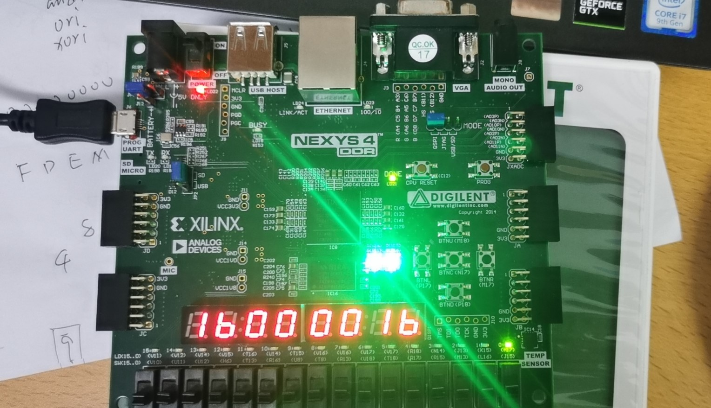

# 五级流水线 MIPS CPU 实验报告

计算机科学与技术

19307130296

孙若诗

## 1、实现指令

### 1.1 R型指令

R-type = op(6) + rs(5) + rt(5) + rd(5) + shamt(5) + funct(6)

* addu : GPR[rd] = GPR[rs] + GPR[rt]
* subu : GPR[rd] = GPR[rs] - GPR[rt]
* and : GPR[rd] = GPR[rs] & GPR[rt]
* or : GPR[rd] = GPR[rs] | GPR[rt]
* nor : GPR[rd] = ~(GPR[rs] | GPR[rt])
* xor : GPR[rd] = GPR[rs] ^ GPR[rt]
* sll : GPR[rd] = GPR[rt] << shamt
* sra : GPR[rd] = GPR[rt] >>> shamt (arithmetic)
* srl : GPR[rd] = GPR[rt] >> shamt (logical)
* slt : GPR[rd] = (GPR[rs] < GPR[rt]) (signed)
* sltu : GPR[rd] = (GPR[rs] < GPR[rt]) (unsigned)
* jr : pc = GPR[rs]

### 1.2 I型指令

I-type = op(6) + rs(5) + rt(5) + imm(16)

* addiu : GPR[rt] = GPR[rs] + sign_extend(imm)
* andi : GPR[rt] = GPR[rs] & zero_extend(imm)
* ori : GPR[rt] = GPR[rs] | zero_extend(imm)
* xori : GPR[rt] = GPR[rs] ^ zero_extend(imm)
* slti : GPR[rt] = (GPR[rs] < imm) (signed)
* sltiu : GPR[rt] = (GPR[rs] < imm) (unsigned)
* lui : GPR[rt] = imm << 16
* beq : if(GPR[rs] == GPR[rt])  pc += 4 + imm << 2
* bne : if(GPR[rs] != GPR[rt])
pc += imm << 2
* lw : GPR[rt] = mem[GPR[rs] + sign_extend(offset)]
* sw : mem[GPR[rs] + sign_extend(offset)] = GPR[rt]

### 1.3 J型指令

J-type = op(6) + instr_index(26)

* j : pc = (pc + 4)[31:28] + (instr_index << 2)
* jal : GPR[31] = pc + 8, pc = (pc + 4)[31:28] + (instr_index << 2)

## 2、阶段分析

参考《数字设计和计算机体系结构》中五级流水线设计

### 2.1 Fetch

这一阶段选择下一条执行的指令地址，并与指令内存交互。SelectPC阶段整合在fetch内，但SelectPC计算出的PC要在时钟上升沿才进入fetch。

### 2.2 Decode

这一阶段的主要任务是：指令解码，生成控制信号、从 Regfile（寄存器文件堆）中读取数据、判断是否跳转。

decode内部控制信号为14位，构成方式为sign_extend(1) + imm_type(2) + reg_dst(2) + reg_write(1) + alu_shamt(1) + alu_imm(1) + alu_funct(4) + memtoreg(1) + mem_write(1)。由于前五位信号仅在decode内部使用，输出控制信号为9位。

首先根据op和funct生成控制信号，从instr获取rsD、rtD、st_imm和shamtD，hazard转发生成修正值rsHD和rtHD。根据reg_dst确定写入寄存器的地址，sign_extend后根据imm_type确定立即数的运算值。

### 2.3 Execute

这一阶段的主要任务是完成计算，围绕ALU展开。

Execute模块的输入数据同样经过hazard转发。首先根据alu_shamt、alu_imm处理出ALU的两个参数，例化ALU进行运算。

rd和vt的值不发生改变，仅传向下一个阶段。

### 2.4 Memory

这一阶段与Data Memory进行数据交互。

### 2.5 Write Back

这一阶段向regfile写数据。

由于regfile已经例化，本模块仅需将reg_write传递给write_enable，将rdM传递给rdW，再根据memtoreg选择写入变量为ReadDataW还是ALUout即可。

### 2.6 Regfile

这一模块用于读写寄存器。有一个写端口，两个读端口，其中读地址来自D阶段，写地址来自W阶段。写部分是时序逻辑，读部分是组合逻辑，并选择更新过后的结果。

### 2.7 Hazard

这一阶段进行转发和阻塞。具体条件详见5.2、5.3部分。

## 3、实验现象

## 4. 修正BUG列表

1. LW在M阶段同样需要阻塞，hazard输入增加loadM信号。
2. ADDIU中imm同样为符号扩展，只是比较时作为无符号数。
3. strobe为4位信号，需要将一位的mem_write信号重复四次。
4. JR进入D阶段时，若相关寄存器处于E阶段将被写，同样需要stall（遵循E阶段不作为转发来源的原则）。
5. resetn初始化与组合逻辑产生多驱动。若组合逻辑能自然赋值就不要重复操作，时序逻辑中只初始化那些CPU运行后也需要在时序逻辑中赋值的内容，也即EMW阶段的输入信号。
6. SelectPC计算跳转pc使用的是D阶段的pc，因此开始也计划将D阶段pc赋初值，但是这样会导致第一条指令被重复执行。实际上第一条指令处于F阶段时必定不会跳转，只需要初始化instrF即可。
7. 除了MyCore中控制的时序逻辑需要stall，fetch中更新pc和instr也需要被阻塞。
8. logic _unused_ok = &{iresp……}; 用于在verilator中解决必要的unused warning。
9. verilator中引用库需要加文件路径，放在include文件夹下则verilator和vivado都容易检测到。
10. 变量重复定义在vivado中只是Warning，使用verilator才会得到Error提醒。
11. SW是不修改寄存器的，reg_dst设为0，避免hazard错误地转发E阶段结果。
12. resetn信号不能被用于组合逻辑，否则按下resetn可能会行为异常。
13. “BLKANDNBLK”指verilator不建议将一个block的不同部分分别用时序和组合逻辑赋值，可以简单地新建中转变量在时序逻辑中赋值，再在组合逻辑中将它赋给原计划赋值的变量。
14. 初始化变量也要考虑位数对齐，“0”默认是32位的，而非自动延长到所需位数。

## 5、讨论

1. 不同指令需要用到的流水线阶段可能不同：加法指令似乎不需要经过 Memory 阶段。能让它跳过 M 阶段吗？

* 可以但很没必要。在其他指令仍然为五级流水的情况下，增加E到W的数据通路只会让电路结构更加复杂。何况加法跳过了M阶段，后续指令仍在E阶段，并没有节省整体运行时间。如果一开始就对指令分类执行，可以有不同流水级数的实现，但是又要考虑在不同流水线之间传递数据的成本。

2. 转发部分：哪些指令写通用寄存器？电路图中的哪些数据线可作为转发来源？转发条件是什么？优先级是什么？

* 除了SW、BEQ、BNE、J、JR，几乎其他所有指令都要写通用寄存器。
* 电路图中M阶段接受的ALUout和W阶段将写入寄存器的数据可作为转发来源。为什么不采用E阶段的结果？此时还不能确定数据已经准备好，毕竟E阶段的输入也需要转发。
* 转发条件是这个数据将被写入寄存器，且写入地址等于D或E阶段访问的地址。E阶段需要转发显然，D阶段则是为了及时确定分支是否跳转。
* Memory比WriteBack优先级更高，因为它包含了更新的执行指令的结果。

3. 冲突阻塞部分：D 阶段取数据，E、M、W 阶段的写数据会造成冲突。哪些情况应当阻塞流水线？

* LW更新了寄存器，但是寄存器的值要到W阶段开始才获得（M读取+内存延迟），此时D阶段取数据会产生冲突。
* D阶段要产生是否跳转的信号，但E阶段还在对相关寄存器进行计算，也就是寄存器数据还没有准备好，需要阻塞。
* JR处于D阶段，此时若相关寄存器处于E阶段，需要阻塞一周期。

4. 延迟槽是如何起作用的？

* 第一周期：fetch接受pc1；
* 第二周期：pc1进入decode，fetch接受pc2；此时pc1形成的pc进入selectpc。
* 第三周期：pc1进入execute，pc2进入decode，pc1形成的pc进入fetch。
* 因此如果pc1要求跳转，它后续一条指令pc2仍会照常执行，直到再下一条指令才做出反应。这就是“delay slot”的机制。
* 没有指令被错误地执行，代价是需要在decode阶段决策是否相等，要求寄存器变量的值被及时转发。

5. 内存延迟解决方法

* 直接将instrF接入D和Regfile，将dataoutM接入W。需要注意的是，instrF应与D阶段pc保持一致，因此stall时F阶段不要读指令内存，将指令内存的地址赋值也加入时序逻辑。

6. 既然LW已经stall，W阶段转发的意义是什么（W阶段才确定的数据不是只有LW吗）？

* 流水线每个阶段的数据都是不同的，可能刚进入decode的指令和W阶段寄存器冲突，此时转发不是由于W阶段刚得到数据，而是因为decode刚得到指令。

7. $signed()是强制类型转换，signed'是类型声明，两种写法是等价的。

8. 进一步体会到了硬件编程和高级语言的不同。因为一个变量只允许assign一次，所以之前的结果不能覆盖，只能再新建变量赋值，对应到硬件上就又增加了一层。如果结构预先未经过审慎设计，电路和代码都会过分复杂。

9. 感觉自己学习本实验相关知识的顺序有些问题。第一周安装环境+读文档，第二周读了数逻和ICS上下的各册课本相关部分，虽然对流水线结构有浅显了解，但是自己实现还是毫无头绪。直到最后一周开始对照电路图和示例代码，从E阶段写起，到D阶段control设计就清晰许多，完成SelectPC后完全理解了流水线的各种工作细节，再去读课本才感到通透。脱离实践的理论意义毕竟有限，何况文字也本来是用来解释而非规定系统的，编程语言在这方面效果更佳。

10. 感谢老师和各位助教学长的指导。争取下次不做ddl战士。