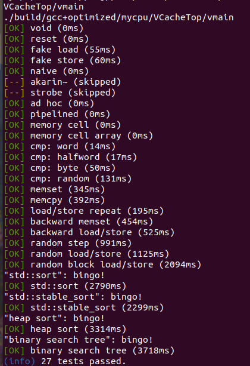
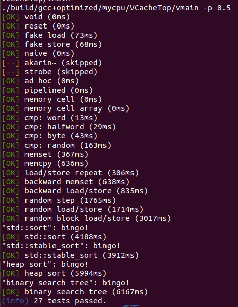

# 实验报告

计算机科学与技术

19307130296

孙若诗

## 缓存描述

1. 本实验实现了写分配、回写的四路缓存。
2. tag为26位，index为2位，offset为4位，因此缓存中共有4个cache set，每个cache set有4条cache line。每条cache line存储4条指令，也即4字、16字节、128位，地址3-2位表示指令在cache line中的偏移量。若考虑缓存性能，设计需要进一步调整。
3. 替换策略为随机替换。出于硬件效率和便于检验正确性考虑，采用伪随机数，将tag的1-0、3-2、5-4、7-6位异或，得到一个2位地址，作为缓存不命中时替换的地址。
4. 每条cache line记录4个值：tag、dirty、valid、data。FETCH后，valid为1，dirty为0。FLUSH后，valid为0，dirty为0（因为FLUSH一定是为了载入新的cache line）。修改data后，valid为0，dirty为1。
5. 缓存的状态为：IDLE、SEARCH、HIT、MISS、FETCH、FLUSH、READY，分别表示空、寻找缓存、命中、不命中、读内存、写内存、读完毕。处理具体事件经过的状态如下：
6. 读hit： IDLE->SEARCH->HIT->READY->IDLE
7. 读miss： IDLE->SEARCH->MISS(->FLUSH)->HIT->FETCH->READY->IDLE
8. 写hit： IDLE->SEARCH->HIT->IDLE
9. 写miss： IDLE->SEARCH->MISS(->FLUSH)->HIT->FETCH->READY->IDLE

## 其他

1. 在关联度为$2^k$的缓存中实现`LRU`算法，每个cache set要记录所有cache line的出现次序，有$2^k$个cache line，出现次序也需要$2^k$位表示，共$2^{2k}$位额外信息。
2. 缓存重置时，在我的实现中不需要将数据重置，但是需要把cache line状态相关量清零。因为dirty和valid都为0时一定会进入FETCH状态和内存取得同步，所以不重置数据不会有影响。不重置则需要注意处理数据初始化问题，重置则需要考虑reset时间不够的问题。

## 实验现象

1. `lab3a` `verilator` 模块级测试

   

   

2. 