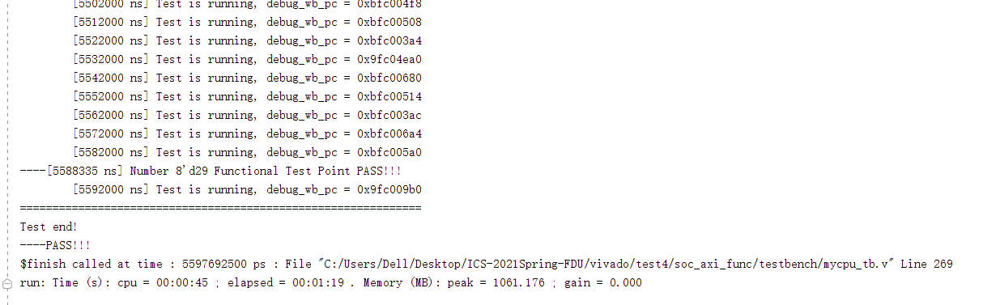
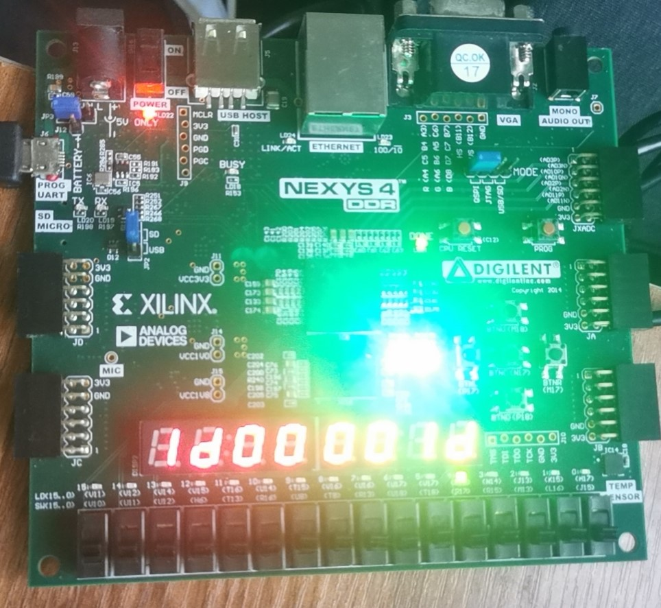
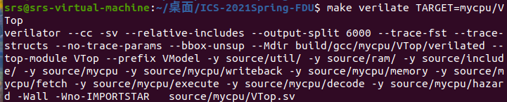

# 实验报告

计算机科学与技术

19307130296

孙若诗

## 1、增加指令

### 1.1 R型指令

R-type = op(6) + rs(5) + rt(5) + rd(5) + shamt(5) + funct(6)

* add : GPR[rd] = GPR[rs] + GPR[rt]
* sub : GPR[rd] = GPR[rs] - GPR[rt]
* break
* syscall

### 1.2 I型指令

I-type = op(6) + rs(5) + rt(5) + imm(16) /

​			  op(6) + funct(5) + rt(5) + rd(5) + special(8) + sel(3) /

​              op(6) + co(1) + special(19) + funct(6)

* addi ： GPR[rt] = GPR[rs] + sign_ext(imm)
* mfc0 ：GPR[rt] = CPR[0, rd, sel]
* mtc0 ：CPR[0, rd, sel] = GPR[rt]
* eret

## 2、设计细节

### 信号维护

1. 使用`cp0`模块维护`cp0`寄存器，类似寄存器文件，在E阶段读，M阶段写，接入的error信号和M阶段保持一致。根据输入的cp0决定新的cp0，并在每个时钟上升沿更新。
2. 将`VTop`中的`ext_int`信号接入`MyCore`，在`cp0`模块使用。
3. 设置一个12位`error`信号在流水段之间传递，表示异常相关信号，分别为`CpWrite`、`CpRead`、`Insolt`、`CheckOver`、`OverError`、`AddrErrorI`、`AddrErrorL`、`AddrErrorS`、`InsEret`、`InsBreak`、`InsSyscall`、`InsExcept`。实际上功能与控制信号类似，但是为了减少对代码的改动不再调整`control`信号。
4. `CpRead`、`CpWrite`分别表示是否读写`cp0`寄存器，从D阶段生成，在W和M阶段使用。
5. `Insolt`信号表示此指令是否在内存槽中，从F阶段生成，逐级传递到M阶段`cp0`模块使用。

### 异常处理

1. 中断（Interrupt）
   * 外部中断：将`ext_int`接入`cp0`模块处理。
   * 时钟中断：在`cp0`模块根据`Compare`和`Count`判断并处理。
   * 软件中断：在`cp0`模块根据`Cause.IP`判断并处理。
   * 对应`ExcCode`均为`Int（00）`
2. 指令地址错误（Address Error-Instruction fetch）
   * 在`FETCH`阶段检查地址后2位，若地址错误则设置`AddrErrorI`信号为1，`BadVaddr`为出错地址，在`cp0`模块处理。
   * 对应`ExcCode`为`AdEL（04）`
3. 保留指令（Instruction Validity Exceptions）
   * 在`DECODE`阶段设置`InsExcept`为1，传递到`cp0`模块处理。
   * 对应`ExcCode`为`RI（0a）`
4. 运行异常（Execution Exception）
   * 溢出：对需要考虑溢出的加法和减法，在`DECODE`阶段设置`CheckOver`为1，对`ALU`增加一个输出信号`over`表示是否溢出，`EXECUTE`阶段计算出`OverError = over & CheckOver`，传递到`cp0`模块处理。对应`ExcCode`为`Ov（0c）`。
   * `break`：在`DECODE`阶段设置`InsBreak`，传递到`cp0`模块处理。对应`ExcCode`为`BP（09）`。
   * `syscall`：在`DECODE`阶段设置`InsSyscall`，传递到`cp0`模块处理。对应`ExcCode`为`Sys（08）`。
5. 数据地址错误（Address error-Data access）
   * 读地址错误：在`MEMORY`阶段检查读地址后2位，若地址错误则设置`AddrErrorL`为1，`BadVaddr`为出错地址，在`cp0`模块处理。对应`ExcCode`为`AdEL（04）`。
   * 写地址错误：在`MEMORY`阶段检查写地址后2位，若地址错误则设置`AddrErrorS`为1，`BadVaddr`为出错地址，在`cp0`模块处理。对应`ExcCode`为`AdES（05）`。
6. 异常处理具体工作有：
   * 清空流水线（设置`flush`为1），把下一条指令`pcN`设为`0xbfc00380`；
   * 将异常原因生成`exccode`写入`Cause.ExcCode`；
   * 若为地址错异常，将出错的地址写入`BadVAddr`寄存器；
   * 若`cp0.Status.EXL`为0，设置`p0.EPC`和`cp0.Cause.BD`；
   * 将`cp0.Status.EXL`设置为1。
7. 异常恢复工作通过`eret`指令实现，具体操作为：执行到M阶段时，清空流水线（设置`flush`为1），将下一条指令`pcN`设为`EPC`，`EPC`设为0。

## 3、讨论

1. 加减法溢出时，结果转发的逻辑可保持不变：在M阶段溢出异常就被处理，之后用到转发结果的指令一定会被冲刷，不产生影响。
2. 关于`cp0`的转发：在M阶段修改寄存器，在E阶段查询，前后只相差一个周期，无需转发。
3. 写入的cp0要在下一条指令时才能用于判断中断，但是cp0是在时钟上升沿更新的，有气泡时下一条指令可能还没有到达M阶段，无法正确获得EPC。考虑气泡不可能带来新的异常，只要限制当前M阶段指令为气泡时不进入中断，就可以等到下一条指令到来。

## 4、测试结果

vivado仿真

上板

verilator编译

